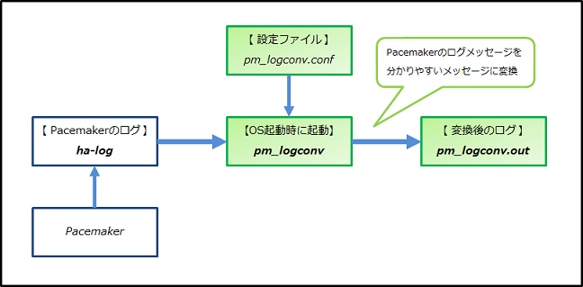

# Pacemakerログ解析支援ツール（pm_logconv-cs-2.4）

- [1. 変換の例](#1-変換の例)
  - [1.1 サービス系リソースの故障によるフェイルオーバ発生時の例](#11-サービス系リソースの故障によるフェイルオーバ発生時の例)
  - [1.2 故障発生ノードのSTONITHを含むフェイルオーバ発生時の例](#12-故障発生ノードのstonithを含むフェイルオーバ発生時の例)
- [2. 動作条件](#2-動作条件)
- [3. インストール](#3-インストール)
- [4. 設定・起動方法](#4-設定起動方法)
  - [4.1. Corosync（ログ出力先）の設定](#41-corosyncログ出力先の設定)
    - [4.1.1. /etc/corosync/corosync.conf の編集](#411-etccorosynccorosyncconf-の編集)
  - [4.2. Pacemaker（ログ出力先）の設定](#42-pacemakerログ出力先の設定)
    - [4.2.1. /etc/sysconfig/pacemaker の編集](#421-etcsysconfigpacemaker-の編集)
    - [4.2.2. /etc/rsyslog.conf の編集](#422-etcrsyslogconf-の編集)
    - [4.2.3. /etc/systemd/journald.conf の編集 【RHEL7 の場合のみ】](#423-etcsystemdjournaldconf-の編集-rhel7-の場合のみ)
    - [4.2.4. /etc/logrotate.d/syslog の編集](#424-etclogrotatedsyslog-の編集)
  - [4.3. pm_logconvの設定（/etc/pm_logconv.conf の作成）](#43-pm_logconvの設定etcpm_logconvconf-の作成)
    - [4.3.1. attributeの指定方法](#431-attributeの指定方法)
    - [4.3.2. act_rscの指定方法](#432-act_rscの指定方法)
  - [4.4. pm_logconvのプロセス起動](#44-pm_logconvのプロセス起動)
- [関連リンク](#関連リンク)
  - [Pacemakerリポジトリパッケージ](#関連リンク)
  - [pm_logconv-cs変換後ログメッセージ一覧](#関連リンク)

本ドキュメントは、Pacemaker-1.1.16リポジトリパッケージに含まれる pm_logconv-cs-2.4 について記述しています。

本ツールpm_logconv-csはPacemakerが出力するログ（ha-log）のうち、特に運用に関係のあるものを抽出し、分かりやすい内容へ変換・出力（pm_logconv.out）するものです。<br>
Pacemakerのログは出力される量が多く、内容が分かりにくいものもありますが、本ツールを使うことで分かりやすい故障情報等を取得できるようになります。

 

## 1. 変換の例
### 1.1 サービス系リソースの故障によるフェイルオーバ発生時の例
- 下記①のクラスタ状態から、
  - PostgreSQL（prmPgリソース）で故障が発生 → Pacemakerが**prmPgリソースの故障を検知**。
  - 故障検知を契機に、**フェイルオーバ処理（ノードpm01のサービス系リソースprmEx～prmPgを停止、ノードpm02で起動）** が実行され、
- 下記②の状態となるまでの、ha-log と pm_logconv.out を提示します。
  - ① 故障発生前 ：
    ```
    Online: [ pm01 pm02 ]

    Full list of resources:

     Resource Group: grpPg
         prmEx	(ocf::heartbeat:sfex):	Started pm01
         prmFs	(ocf::heartbeat:Filesystem):	Started pm01
         prmIp	(ocf::heartbeat:IPaddr2):	Started pm01
         prmPg	(ocf::heartbeat:pgsql):	Started pm01

    Migration Summary:
    * Node pm02:
    * Node pm01:
    ```
    - prmEx～prmPgはサービス系リソースとして本ツールに設定。 設定方法は [4.3. pm_logconvの設定](#43-pm_logconvの設定etcpm_logconvconf-の作成) で説明します。
  - ② 故障検知・フェイルオーバ完了後 ：
    ```
    Online: [ pm01 pm02 ]

    Full list of resources:

     Resource Group: grpPg
         prmEx	(ocf::heartbeat:sfex):	Started pm02
         prmFs	(ocf::heartbeat:Filesystem):	Started pm02
         prmIp	(ocf::heartbeat:IPaddr2):	Started pm02
         prmPg	(ocf::heartbeat:pgsql):	Started pm02

    Migration Summary:
    * Node pm02:
    * Node pm01:
       prmPg: migration-threshold=1 fail-count=1 last-failure='Mon Apr 24 06:19:55 2017'

    Failed Actions:
    * prmPg_monitor_10000 on pm01 'not running' (7): call=25, status=complete, exitreason='none',
        last-rc-change='Mon Apr 24 06:19:55 2017', queued=0ms, exec=0ms
    ```
- ノードpm01（DCノード）のログ ：
  - ha-log [(こちらのページを参照)](doc/ha-log.md#変換の例-1--ノードpm01の-ha-log)
  - pm_logconv.out
    ```
    Apr 24 06:19:55 pm01   error: Resource prmPg does not work. (rc=7) not running	# リソースの故障検知時のha-log(③)を変換したログ
    Apr 24 06:19:55 pm01   error: Start to fail-over.				#「フェイルオーバ」処理の開始を示す(DCノードで出力される)ログ
    Apr 24 06:19:55 pm01    info: Resource prmPg tries to stop.			# リソースの停止処理－開始時のha-log(④)と、
    Apr 24 06:19:56 pm01    info: Resource prmPg stopped. (rc=0) ok			# リソースの停止処理－完了時のha-log(⑤)を変換したログ
    Apr 24 06:19:56 pm01    info: Resource prmIp tries to stop.
    Apr 24 06:19:56 pm01    info: Resource prmIp stopped. (rc=0) ok
    Apr 24 06:19:56 pm01    info: Resource prmFs tries to stop.
    Apr 24 06:19:56 pm01    info: Resource prmFs stopped. (rc=0) ok
    Apr 24 06:19:56 pm01    info: Resource prmEx tries to stop.
    Apr 24 06:19:56 pm01    info: Resource prmEx stopped. (rc=0) ok
    Apr 24 06:19:59 pm01    info: Resource prmEx : Move pm01 -> pm02		#「フェイルオーバ」処理のサマリのログ
    Apr 24 06:19:59 pm01    info: Resource prmPg : Move pm01 -> pm02
    Apr 24 06:19:59 pm01    info: fail-over succeeded.				#「フェイルオーバ」処理の完了(成功)を示すログ
    ```
- ノードpm02（非DCノード）のログ ：
  - ha-log [(こちらのページを参照)](doc/ha-log.md#変換の例-1--ノードpm02の-ha-log)
  - pm_logconv.out
    ```
    Apr 24 06:19:55 pm02    info: Resource prmEx tries to start.			# リソースの開始処理－開始時のha-log(⑥)と、
    Apr 24 06:19:56 pm02    info: Resource prmEx started. (rc=0) ok			# リソースの開始処理－完了時のha-log(⑦)を変換したログ
    Apr 24 06:19:56 pm02    info: Resource prmFs tries to start.
    Apr 24 06:19:57 pm02    info: Resource prmFs started. (rc=0) ok
    Apr 24 06:19:57 pm02    info: Resource prmIp tries to start.
    Apr 24 06:19:57 pm02    info: Resource prmIp started. (rc=0) ok
    Apr 24 06:19:57 pm02    info: Resource prmPg tries to start.
    Apr 24 06:19:58 pm02    info: Resource prmPg started. (rc=0) ok
    ```

### 1.2 故障発生ノードのSTONITHを含むフェイルオーバ発生時の例
- 下記⑧のクラスタ状態から、
  - ノードpm01でNW経路の故障が発生 → **ノードpm01のNW監視（pingリソース）が経路故障を検知**。
  - 故障検知を契機に**フェイルオーバ処理が開始**されるが、prmPgリソースの停止処理（on-fail="fence"）が失敗 → **ノードpm01はノードpm02からSTONITHされる**。
  - ノードpm01のSTONITH成功後にノードpm02でリソースが起動した、
- 下記⑨の状態となるまでの、ha-log と pm_logconv.out を提示します。
  - ⑧ 故障発生前 ：
    ```
    Online: [ pm01 pm02 ]

    Full list of resources:

     Resource Group: grpPg
         prmEx	(ocf::heartbeat:sfex):	Started pm01
         prmFs	(ocf::heartbeat:Filesystem):	Started pm01
         prmIp	(ocf::heartbeat:IPaddr2):	Started pm01
         prmPg	(ocf::heartbeat:pgsql):	Started pm01
     Resource Group: grpStonith1
         prmStonith1-1	(stonith:external/stonith-helper):	Started pm02
         prmStonith1-2	(stonith:external/libvirt):	Started pm02
     Resource Group: grpStonith2
         prmStonith2-1	(stonith:external/stonith-helper):	Started pm01
         prmStonith2-2	(stonith:external/libvirt):	Started pm01
     Clone Set: clnDiskd1 [prmDiskd1]
         Started: [ pm01 pm02 ]
     Clone Set: clnDiskd2 [prmDiskd2]
         Started: [ pm01 pm02 ]
     Clone Set: clnPing [prmPing]
         Started: [ pm01 pm02 ]

    Node Attributes:
    * Node pm01:
        + default_ping_set                	: 100
        + diskcheck_status                	: normal
        + diskcheck_status_internal       	: normal
    * Node pm02:
        + default_ping_set                	: 100
        + diskcheck_status                	: normal
        + diskcheck_status_internal       	: normal

    Migration Summary:
    * Node pm02:
    * Node pm01:
    ```
    - prmEx～prmPgはサービス系リソースとして本ツールに設定。 設定方法は [4.3. pm_logconvの設定](#43-pm_logconvの設定etcpm_logconvconf-の作成) で説明します。
  - ⑨ 故障検知・フェイルオーバ完了後 ：
    ```
    Online: [ pm02 ]
    OFFLINE: [ pm01 ]

    Full list of resources:

     Resource Group: grpPg
         prmEx	(ocf::heartbeat:sfex):	Started pm02
         prmFs	(ocf::heartbeat:Filesystem):	Started pm02
         prmIp	(ocf::heartbeat:IPaddr2):	Started pm02
         prmPg	(ocf::heartbeat:pgsql):	Started pm02
     Resource Group: grpStonith1
         prmStonith1-1	(stonith:external/stonith-helper):	Started pm02
         prmStonith1-2	(stonith:external/libvirt):	Started pm02
     Resource Group: grpStonith2
         prmStonith2-1	(stonith:external/stonith-helper):	Stopped
         prmStonith2-2	(stonith:external/libvirt):	Stopped
     Clone Set: clnDiskd1 [prmDiskd1]
         Started: [ pm02 ]
         Stopped: [ pm01 ]
     Clone Set: clnDiskd2 [prmDiskd2]
         Started: [ pm02 ]
         Stopped: [ pm01 ]
     Clone Set: clnPing [prmPing]
         Started: [ pm02 ]
         Stopped: [ pm01 ]

    Node Attributes:
    * Node pm02:
        + default_ping_set                	: 100
        + diskcheck_status                	: normal
        + diskcheck_status_internal       	: normal

    Migration Summary:
    * Node pm02:
    ```
- ノードpm01（DCノード）のログ ：
  - ha-log [(こちらのページを参照)](doc/ha-log.md#変換の例-2--ノードpm01の-ha-log)
  - pm_logconv.out
    ```
    Apr 24 06:26:35 pm01   error: Network to 192.168.201.254 is unreachable.				# NW経路故障検知時のha-log(⑩)を変換したログ
    Apr 24 06:26:35 pm01    info: Attribute "default_ping_set" is updated to "0" at "pm01".			# 属性変更時のha-log(⑪)を変換したログ
    Apr 24 06:26:40 pm01    info: Resource prmPg tries to stop.
    Apr 24 06:26:43 pm01   error: Resource prmPg failed to stop. (rc=1) unknown error			# STONITHされたためここまでの出力
    ```
- ノードpm02（非DCノード）のログ ：
  - ha-log [(こちらのページを参照)](doc/ha-log.md#変換の例-2--ノードpm02の-ha-log)
  - pm_logconv.out
    ```
    Apr 24 06:26:34 pm02    info: Attribute "default_ping_set" is updated to "0" at "pm01".			# 属性変更時のha-log(⑪)を変換したログ
    Apr 24 06:26:40 pm02   error: Start to fail-over.
    Apr 24 06:26:43 pm02    info: Try to STONITH (reboot) pm01.						# STONITH処理－開始時のha-log(⑫)を変換したログ
    Apr 24 06:26:43 pm02    info: Try to execute STONITH device prmStonith1-1 on pm02 for reboot pm01.	# stonith-helperプラグインによるSTONITH(ノードの生死確認・相撃ち防止)処理
    Apr 24 06:26:47 pm02 warning: Failed to execute STONITH device prmStonith1-1 for pm01.
    Apr 24 06:26:47 pm02    info: Try to execute STONITH device prmStonith1-2 on pm02 for reboot pm01.	# STONITHデバイス実行－開始時のha-log(⑬)を変換したログ
    Apr 24 06:26:50 pm02 warning: Node pm01 is lost								# クラスタからノード離脱時のha-log(⑭)を変換したログ
    Apr 24 06:26:52 pm02    info: Succeeded to execute STONITH device prmStonith1-2 for pm01.		# STONITHデバイス実行－成功時のha-log(⑮)を変換したログ
    Apr 24 06:26:52 pm02    info: Succeeded to STONITH (reboot) pm01 by pm02.				# STONITH処理－成功時のha-log(⑯)を変換したログ
    Apr 24 06:26:52 pm02    info: Resource prmEx tries to start.
    Apr 24 06:28:03 pm02    info: Resource prmEx started. (rc=0) ok
    Apr 24 06:28:03 pm02    info: Resource prmFs tries to start.
    Apr 24 06:28:03 pm02    info: Resource prmFs started. (rc=0) ok
    Apr 24 06:28:03 pm02    info: Resource prmIp tries to start.
    Apr 24 06:28:04 pm02    info: Resource prmIp started. (rc=0) ok
    Apr 24 06:28:04 pm02    info: Resource prmPg tries to start.
    Apr 24 06:28:05 pm02    info: Resource prmPg started. (rc=0) ok
    Apr 24 06:28:05 pm02    info: Resource prmEx : Move pm01 -> pm02
    Apr 24 06:28:05 pm02    info: Resource prmPg : Move pm01 -> pm02
    Apr 24 06:28:05 pm02    info: fail-over succeeded.
    ```

## 2. 動作条件
- (1) 本ツールは、必ず、リポジトリパッケージに同梱のPacemakerと使用すること。
  - 例えば、Pacemaker-1.1.15リポジトリパッケージのpm_logconv-csでは、Pacemaker-1.1.16リポジトリパッケージのPacemakerのログを正しく変換できません。
- (2) PacemakerとCorosyncのログが、syslog経由でログファイルに出力するよう設定されていること。
  - 本ドキュメントで示すログファイルの設定例（出力先）は、/var/log/ha-log です。
- (3) rsyslogが大量のログ出力の制限を行わないように設定されていること。

※ (2)と(3)の設定方法は、[4.2. Pacemaker（ログ出力先）の設定](#42-pacemakerログ出力先の設定) で説明します。

## 3. インストール
本ツール（pm_logconv-cs）は対応するPacemakerと共に、Pacemakerリポジトリパッケージに含まれています。

- [Pacemakerリポジトリパッケージ](https://linux-ha.osdn.jp/wp/dl)

Pacemakerのインストール時に、pm_logconv-csもインストールされます。

- **参考情報**： [Pacemaker-1.1.16-1.1のインストール手順](https://linux-ha.osdn.jp/wp/archives/4618)

- (1) Pacemakerリポジトリパッケージの展開
  ```
  # rpm -ivh pacemaker-repo-1.1.16-1.1.el7.x86_64.rpm
  準備しています...              ################################# [100%]
  更新中 / インストール中...
     1:pacemaker-repo-1.1.16-1.1.el7    ################################# [100%]
  ```
- (2) yumキャッシュのクリア
  ```
  # yum clean all

   (省略)

  Cleaning up everything
  ```
- (3) Pacemakerのインストール
  ```
  # yum install -y pacemaker-all

   (省略)

  インストール:
    pacemaker-all.noarch 0:1.1.16-1.1.el7

  依存性関連をインストールしました:

   (省略)

    pm_extras.x86_64 0:2.3-1.el7              pm_logconv-cs.noarch 0:2.4-1.el7
    pssh.noarch 0:2.3.1-5.el7                 resource-agents.x86_64 0:4.0.1-1.el7

  完了しました!
  ```

## 4. 設定・起動方法
本ツールを動作させるためには、PacemakerとCorosyncが停止している状態で、以下の設定ファイルを編集します。

**Corosync（ログ出力先）の設定**
- (1) [/etc/corosync/corosync.conf の編集](#411-etccorosynccorosyncconf-の編集)

**Pacemaker（ログ出力先）の設定**
- (2) [/etc/sysconfig/pacemaker の編集](#421-etcsysconfigpacemaker-の編集)
- (3) [/etc/rsyslog.conf の編集](#422-etcrsyslogconf-の編集)
- (4) [/etc/systemd/journald.conf の編集 【RHEL7 の場合のみ】](#423-etcsystemdjournaldconf-の編集-rhel7-の場合のみ)
- (5) [/etc/logrotate.d/syslog の編集](#424-etclogrotatedsyslog-の編集)

**pm_logconvの設定**
- (6) [/etc/pm_logconv.conf の作成](#43-pm_logconvの設定etcpm_logconvconf-の作成)

### 4.1. Corosync（ログ出力先）の設定
#### 4.1.1. /etc/corosync/corosync.conf の編集
Corosyncのログ出力に関する設定を変更します。
```
# vi /etc/corosync/corosync.conf

 (省略)

logging {
         syslog_facility: local1	    #(1) syslog_facilityに "local1" を設定
         debug: off
}
```
| No	| 設定項目			| 設定内容	| デフォルト値	|
|-	| -				| -		| -		|
| (1)	| logging/syslog_facility	| Corosyncログのsyslog-facilityを指定します。<br>* 指定した値は [4.2.2. /etc/rsyslog.conf の編集](#422-etcrsyslogconf-の編集) で使用します。<br>* "local1" は一例であり環境に応じて変更できます。	| daemon	|

### 4.2. Pacemaker（ログ出力先）の設定
#### 4.2.1. /etc/sysconfig/pacemaker の編集
Pacemakerの設定ファイルに、Pacemakerのログ出力に関する設定を追加します。

- RHEL6 の場合
  ```
  # vi /etc/sysconfig/pacemaker

   (省略)

  export PCMK_logfile=none		#(1) 以下の行を追記
  export PCMK_logfacility=local1		#(2)
  export PCMK_logpriority=info		#(3)
  ```
- RHEL7 の場合
  ```
  # vi /etc/sysconfig/pacemaker

   (省略)

  PCMK_logfile=none			#(1) 以下の行を追記
  PCMK_logfacility=local1			#(2)
  PCMK_logpriority=info			#(3)
  ```
| No	| 設定項目		| 設定内容	| デフォルト値	|
|-	| -			| -		| -		|
| (1)	| PCMK_logfile		| Pacemakerログの出力先（非syslog経由）を指定します。<br>* なお、本ツールは「非syslog経由のPacemakerログの変換」を<br>　サポートしていません。<br>* 出力を抑止するには "none" を指定します。		| /var/log/pacemaker.log	|
| (2)	| PCMK_logfacility	| Pacemakerログのsyslog-facilityを指定します。<br>* 指定した値は [4.2.2. /etc/rsyslog.conf の編集](#422-etcrsyslogconf-の編集) で使用します。<br>* "local1" は一例であり環境に応じて変更できます。	| daemon			|
| (3)	| PCMK_logpriority	| Pacemakerログのsyslog-priorityを指定します。<br>* 本ツールが正しく変換を行うには "info" 以上のログが必要です。											| notice			|

#### 4.2.2. /etc/rsyslog.conf の編集
本ツールが正しく変換を行うには、PacemakerとCorosyncのログがsyslog経由で出力される必要があるため、rsyslog.confにPacemakerとCorosyncのログの出力先の設定を追加します。<br>
以下は、PCMK_logfacility（[4.2.1. /etc/sysconfig/pacemaker の編集](#421-etcsysconfigpacemaker-の編集)）と、logging/syslog_facility（[4.1.1. /etc/corosync/corosync.conf の編集](#411-etccorosynccorosyncconf-の編集)）に "local1" を指定した場合の例です。
```
# vi /etc/rsyslog.conf

 (省略)

*.info;mail.none;authpriv.none;cron.none;local1.none   /var/log/messages	# "local1.none" を追記

local1.info                /var/log/ha-log;RSYSLOG_TraditionalFileFormat	# １行追記
```
- **RSYSLOG_TraditionalFileFormatの指定について**
  - 本ツールが読み込むログの形式は、RHELデフォルトの出力形式である必要があります。
  - 他の出力形式の変更・設定の影響を受けないよう "RSYSLOG_TraditionalFileFormat" を明記します。

また、フェイルオーバの実行時にPacemakerが一時的に大量のログを出力した場合、rsyslogにより出力が制限されることがあります。<br>
その場合、本ツールはクラスタの状態に即した変換ログを出力することができないため、rsyslogのログ出力制限機能を無効化します。
- RHEL6 の場合
  ```
  # vi /etc/rsyslog.conf

   (省略)

  # Use default timestamp format
  $SystemLogRateLimitInterval 0		# １行追記
  ```
- RHEL7 の場合
  ```
  # vi /etc/rsyslog.conf

   (省略)

  # Use default timestamp format
  $SystemLogRateLimitInterval 0		# １行追記
  $imjournalRatelimitInterval 0		# １行追記
  ```
- **rsyslogのログ出力制限機能（大量のログ出力を制限する機能）とは**
  - 一定の期間内に一定数のメッセージ（閾値は以下に列挙）がシステムログに出力された場合、rsyslogがそれ以降のメッセージを破棄し、システムログへの出力が制限される機能を指します。
  - デフォルト設定での閾値（期間とメッセージ数）は以下の通り。
    - 同一プロセスから、５秒間に200メッセージ ： http://www.rsyslog.com/changing-the-settings/
    - 10分間に20000メッセージ ： http://www.rsyslog.com/doc/v7-stable/configuration/modules/imjournal.html

設定追加後、rsyslogを再起動します。
- RHEL6 の場合
  ```
  # service rsyslog restart
  ```
- RHEL7 の場合
  ```
  # systemctl restart rsyslog
  ```

#### 4.2.3. /etc/systemd/journald.conf の編集 【RHEL7 の場合のみ】
- RHEL7 の場合のみ、journald.confにrsyslogと同様にログ出力制限機能を無効化する設定を追加します。
  ```
  # vi /etc/systemd/journald.conf

   (省略)

  [Journal]
  RateLimitInterval=0s			# RateLimitIntervalに "0s" を設定
  ```
- 設定追加後、journaldを再起動します。
  ```
  # systemctl restart systemd-journald
  ```

#### 4.2.4. /etc/logrotate.d/syslog の編集
Pacemakerログのローテーション設定を追加します。
```
# vi /etc/logrotate.d/syslog
/var/log/cron
/var/log/maillog
/var/log/messages
/var/log/secure
/var/log/spooler
/var/log/ha-log			# １行追記
{
    missingok
    sharedscripts
    postrotate
	/bin/kill -HUP `cat /var/run/syslogd.pid 2> /dev/null` 2> /dev/null || true
    endscript
}
```

### 4.3. pm_logconvの設定（/etc/pm_logconv.conf の作成）
本ツールの設定は /etc/pm_logconv.conf に行います。
- /etc/pm_logconv.conf は、/etc/pm_logconv.conf.sample（サンプルの設定ファイル）をコピーして作成します。
- クラスタを構成する全てのノードで、同じ設定を行う必要があります。
- 設定変更後は変更を反映するためpm_logconvを再起動します。
```
# cp -p /etc/pm_logconv.conf.sample /etc/pm_logconv.conf
# vi /etc/pm_logconv.conf

#
# pm_logconv.conf : Config file of pm_logconv for Pacemaker and Corosync
#
#
[Settings]
#ha_log_path = /var/log/ha-log										#(1)
#output_path = /var/log/pm_logconv.out									#(2)
#output_logfacility = local2										#(3)
#syslogformat = True											#(4)
#attribute_ping = not_defined default_ping_set or default_ping_set lt 100				#(5)
#attribute_diskd = not_defined diskcheck_status or diskcheck_status eq ERROR				#(5)
#attribute_diskd_inner = not_defined diskcheck_status_internal or diskcheck_status_internal eq ERROR	#(5)
#logconv_logfacility = daemon										#(6)
#logconv_logpriority = info										#(7)
#act_rsc = prmExPostgreSQLDB, prmApPostgreSQLDB								#(8)
```
| No	| 設定項目		| 設定内容	| デフォルト値	|
|-	| -			| -		| -		|
| (1)	| ha_log_path		| 変換対象のPacemakerログを指定します。														| /var/log/ha-log		|
| (2)	| output_path		| 変換後ログメッセージの出力先（非syslog経由）を指定します。<br>* 出力を抑止するには "none" を指定します。					| /var/log/pm_logconv.out	|
| (3)	| output_logfacility	| 変換後ログメッセージをsyslog経由で出力する場合、<br>facilityを指定します。<br>* 指定しない場合、syslog経由では出力しません。			| なし				|
| (4)	| syslogformat		| 変換後ログメッセージの日時出力フォーマットを指定します。<br>* True指定時 : syslogフォーマットで出力されます。<br>* False指定時 : ha-logフォーマットで出力されます。	| True	|
| (5)	| attribute_pingなど	| ping, diskdを使用する場合に指定します。<br>指定方法は [4.3.1. attributeの指定方法](#431-attributeの指定方法) で説明します。			| なし				|
| (6)	| logconv_logfacility	| 本ツールの実行ログのsyslog-facilityを指定します。												| daemon			|
| (7)	| logconv_logpriority	| 本ツールの実行ログのsyslog-priorityを指定します。												| info				|
| (8)	| act_rsc		| サービスを提供するために必要なリソースのIDを指定します。<br>指定方法は [4.3.2. act_rscの指定方法](#432-act_rscの指定方法) で説明します。	| なし				|

#### 4.3.1. attributeの指定方法
ネットワークやディスク監視機能の結果（pingやdiskdの属性値）によるリソース配置制御のルールを設定する場合、attribute_xxx（項目名はセクション内で一意であること）に同じルールを指定します。<br>
本設定により、ネットワークやディスクの異常検知を契機とした、act_rscに設定したリソースの移動を "フェイルオーバ" と変換出力します。

**[設定例]**<br>
crmファイルに、監視機能の結果（属性値）によるリソース配置制御のルールを設定する場合、
```
### Resource Location ###
location rsc_location-grpPg-1 grpPg \
	rule 200: #uname eq pm01 \
	rule 100: #uname eq pm02 \
	rule -INFINITY: not_defined default_ping_set or default_ping_set lt 100 \			# 左記(ping 使用時)のルールをattributeに指定します →①
	rule -INFINITY: not_defined diskcheck_status or diskcheck_status eq ERROR \			# 左記(diskd使用時)のルールをattributeに指定します →②
	rule -INFINITY: not_defined diskcheck_status_internal or diskcheck_status_internal eq ERROR	# 左記(diskd使用時)のルールをattributeに指定します →③
```
attribute_xxxは以下のように設定します。
```
# vi /etc/pm_logconv.conf
 (省略)
[Settings]
attribute_ping = not_defined default_ping_set or default_ping_set lt 100				←①
attribute_diskd = not_defined diskcheck_status or diskcheck_status eq ERROR				←②
attribute_diskd_inner = not_defined diskcheck_status_internal or diskcheck_status_internal eq ERROR	←③
```

#### 4.3.2. act_rscの指定方法
act_rscにはサービスを提供するために必要となるPrimitiveリソースのIDを指定します。<br>
故障発生時に指定したリソースが停止すると、フェイルオーバの開始とみなし、その後、指定したリソース全てが起動しているかどうかでフェイルオーバの成否を判断します。

**[設定例]**<br>
サービス系のリソースがGroupリソース（grpPg）の場合、
```
Online: [ pm01 pm02 ]

Full list of resources:

 Resource Group: grpPg
     prmEx      (ocf::heartbeat:sfex):  Started pm01
     prmFs      (ocf::heartbeat:Filesystem):    Started pm01
     prmIp      (ocf::heartbeat:IPaddr2):       Started pm01
     prmPg      (ocf::heartbeat:pgsql): Started pm01
```
act_rscには、最初と最後のPrimitiveリソースのIDを指定します。
```
act_rsc = prmEx, prmPg
```
- **注意**： 指定できるリソースIDは、PrimitiveリソースのIDのみです。
  - GroupやClone、Master/Slave リソースのIDは指定できません。
  - 指定してもフェイルオーバ関連の変換ログは出力されません。
- **注意**： フェイルオーバ時にUnmanagedのリソースがある場合、フェイルオーバは"失敗"とみなされます。
  - 手動によるUnmanagedと、故障によるUnmanagedは区別しません。
  - Unmanagedとなっている場合は、手動で通常（managed）状態に戻してください。

### 4.4. pm_logconvのプロセス起動
本ツール（pm_logconvのプロセス）は、Pacemakerを起動する前に起動（常駐起動）させます。

- RHEL6 の場合は、pm_logconvプロセスを起動します。
  ```
  # initctl start pm_logconv_init
  pm_logconv_init start/running, process 956
  #
  ```
- RHEL7 の場合は、pm_logconvの自動起動を有効にし、pm_logconvプロセスを起動します。
  ```
  # systemctl enable pm_logconv
  ln -s '/usr/lib/systemd/system/pm_logconv.service' '/etc/systemd/system/multi-user.target.wants/pm_logconv.service'

  # systemctl start pm_logconv
  #
  ```

## 関連リンク
- [Pacemakerリポジトリパッケージ](https://linux-ha.osdn.jp/wp/dl)
- [pm_logconv-cs変換後ログメッセージ一覧](doc/conv-msg.md)
